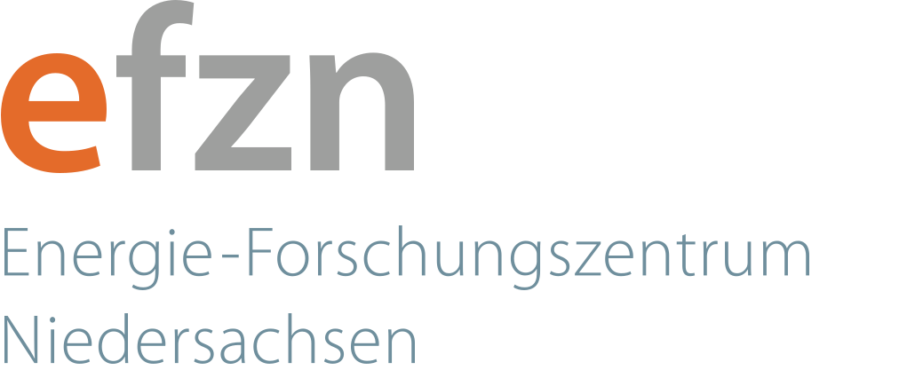
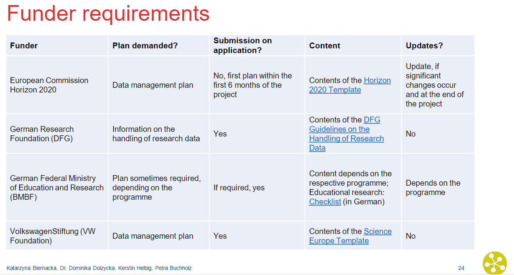

<!--
author:   C3L
email:    antje.ahrens@uol.de
Version:  1.0
language: en

mode:     Textbook

narrator: US English Female

logo:     

-->

----
# EFZN_RDM
{:.no_toc}

Resources and Materials for the RDM Course sponsored by EFZN

- TOC
{:toc}

----

# Course Overview

Welcome to "Research Data Management in the Energy Sector"! This course is dedicated to teach all skills necessary to understand the principles and motivation behind Research Data Management (RDM) and enable you to implement RDM in your work and research group.

The course will focus on applicability in the energy sector.

### Roadmap

<iframe src="https://wp.uni-oldenburg.de/innovative-hochschule-jade-oldenburg-wise20182019/wp-admin/admin-ajax.php?action=h5p_embed&id=19" width="958" height="663" frameborder="0" allowfullscreen="allowfullscreen" title="Research Data Management in the Energy Sector"></iframe>

If you complete the course, you will have established a basic Data Management Plan for a project of your choice that you can build upon and adapt. However, if you have time restraints or already a broad understanding of handling research data, you may choose to go for individual learning sections by clicking on them.

---

## What is Research Data Management?

 

<!--Scenario 2: In 2009, T-Mobile was the largest mobile network provider in Germany with over 40 million customers. Nevertheless, on April 21st a service disruption occurred at around 4 p.m., which was to go down as the biggest in history. In one fell swoop, millions of customers were suddenly unable to connect to the network. Calls could not be connected, nor could SMS be sent. The reason for this was a simultaneous failure of all three home location registers. Together, these three servers form a distributed database and are a central component of every mobile network. Normally, the network could still function as long as only one of the three servers is still active. But how did all three servers suddenly crash?
The answer was made public in the press a few days later. A faulty software update was installed on all three servers at the same time. Because of this, the servers could not support each other because they were struggling with the same problem. It was only at around 8 p.m. of the same day that the software update was cleaned up and a large part of the network was restored to operation.

[[There are several solutions possible: the most important precaution when running new software is to test it in a safe environment whose potential failure will not affect the functionaluty of the system at large. Also, a step-by-step procedure updating only one server at a time could have limited damage. ]]

Scenario 3: you read a fascinating paper in a neighbouring reseach field. You are immediately intrigued - you could build upon these results with your research! But unfortunately, the data and metadata were not uploaded in a repository. So you try to contact the author of the paper. Unfortunately, she doesn't work at the respective institute anymore and does not have access to the in-house file system anymore. She refers you to her graduate student who did the actual study - but he married and has changed his surname. Finally, you get a hold of him and he sends you the data file - unfortunately, it is full of cryptic acronyms and the software he used to process the data has been discontinued... 

Scenario 4: use the [TIB-Video](https://av.tib.eu/media/31036)
-->

In early 2020, the COVID-19 disease, caused by the coronavirus SARS-CoV2, broke out globally, which led to the closure of many shops and businesses for quarantine reasons. The result, especially in the USA, was a large number of unemployed people who urgently needed money for their next rent payment, food or other expenses. As a consequence, the government decided to set up a relief package for anyone who registers as unemployed - but why didn't the money get to the people?
The reason for this was the overload of critical systems on which COBOL is still running. COBOL is a programming language that was developed in the late 1950s to control commercial applications. From today's perspective, the programming language is very outdated and no longer taught in the training of programmers. That is why there was no personnel to take care of the systems when they collapsed. Unfortunately, many applications with the outdated programming language are still running in the business sector. 

>**Exercise**: Suggest two possible process changes that could have prevented the outcome of the scenario:

[[There are several solutions possible: Existing systems should be questioned, since requirements can change and established habits can lead to problems from today's perspective. For example, at some point data might no longer be able to be called up or might exist in formats that are increasingly difficult to be processed. A thorough documentation of the programs might also help in some cases to rebuild them in other languages. For timely relief, the administration called out to retired COBOL programmers to ]]
<!--- Infobox: 3-2-1- rule at some point, maybe in Tools&Tricks-->

Source: [Scarytales 26: If it ain't broken... CC 0](https://forschungsdaten-thueringen.de/fdm-scarytales/articles/ueberblick.html)

While maybe not as critical for society at large, scientists can face similar problem when trying to access old data or programs that were written for other purposes but are know needed for the current tasks: Data are insufficiently labeled, have been overwritten, commercial computer programs have been discontinued or process details have not been recorded.

**Research Data Management** (RDM) aims to break this dynamic by ensuring a sustainable and coherent strategy for all data types throughout the research process, enabling researchers to store, access and re-use their own work effectively and safely and opening their findings worldwide to improve on cross-disciplinary collaboration, monitoring and replication.

RDM includes all activities associated with

* processing
* storage
* preserving and
* publication

of research data.

{: .shadow}

Quelle: https://ukdataservice.ac.uk/learning-hub/research-data-management/, recreated by Antje Ahrens. Licensed under CC-BY-4.0

---

## Open Science

>**Research**: Is there an open science or research data policy at your institution?
What is its scope? What is regulated and how?
If not: 
Would you like to have a research data policy?
What content should it have?

### FAIR Guiding Principles

> "As open as possible, as closed as necessary" 

This is the main idea behind the FAIR principles. The acronym stands for

* Findable
* Accessible
* Interoperable
* Re-Usable

For the original paper on the FAIR Guiding Principles, see: https://www.nature.com/articles/sdata201618
<!-- insert doi and title here instead -->

>**Exercise**: Look closely at the graph to indentify which measures especially apply to your area of work and data types you are using.

> **Quiz**: What can you do to make your data FAIRer?    

    [[X]] use Creative-Commons or GNU Licenses
    [[ ]] keep processing details undisclosed
    [[ ]] ensure access security 
    [[X]] create detailed Metadata    
    [[X]] ensure long-term accessibility in repositories

---

## Data Management Plan
The Data Management Plan (DMP) contains all information that describes and documents sufficiently the collection, processing, storage, archiving and publication of research data within a research project.  

Many public funding organizations require a DMP prior to granting funds for research projects, thus making DMPs an integral part of the scientific process, especially in data-intensive research fields such as the energy sector.

--> hier am besten relevante Geldgeber für die Branche einfügen

A Data Manage 

--> brauche ich aber auf englisch!

There are several tools available that can be helpful in the creation of a DMP (see Tricks & Tools for some examples). In our example, we will work with **RDMO**, a tool that can be used collaboratively and exports into different formats. 

Start by clicking on the following Link:
https://rdmo.forschungsdaten.info/

--> work with short screencasts/gifs that show the important steps

>**Exercise**: Choose a questionnaire that you want to follow. Start by filling in your project details.

Congratulations! You have started your first DMP!

## Sources: 
* Maxi Kindling, Peter Schirmbacher, Elena Simukovic: Forschungsdatenmanagement an Hochschulen: das Beispiel der Humboldt-Universität zu Berlin. LIBREAS. Library Ideas, 23 (2013).
https://doi.org/10.18452/9041.