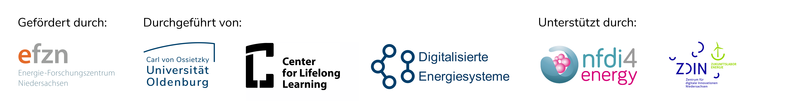
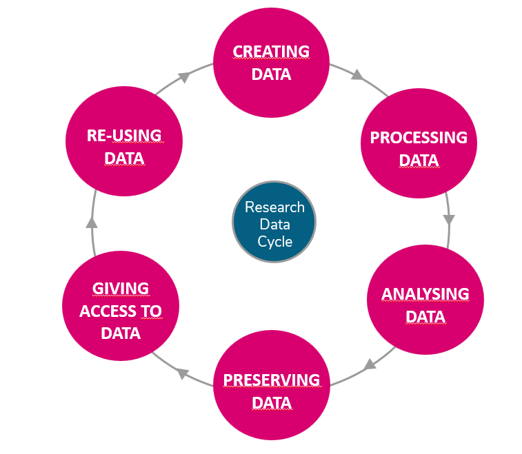
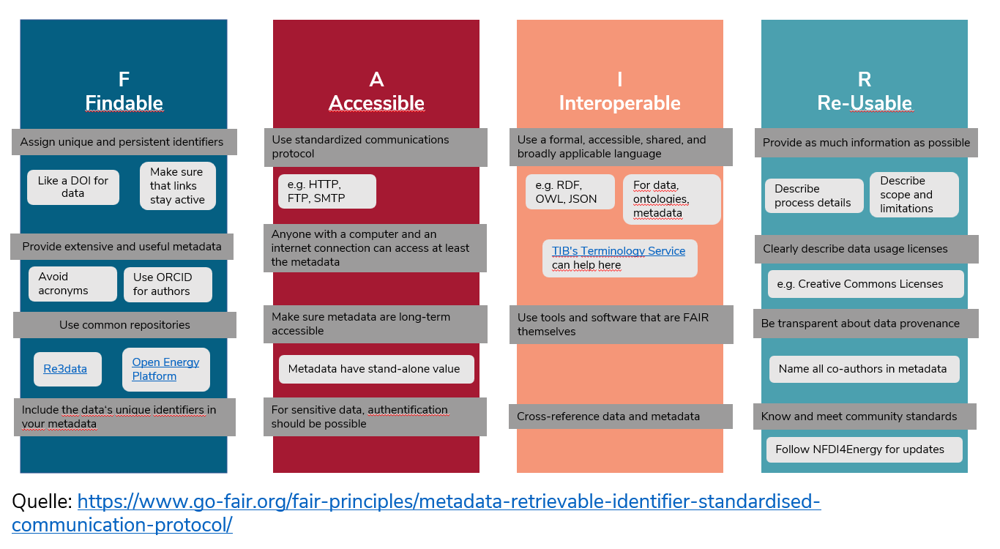

<!-- 
author:   C3L
email:    antje.ahrens@uol.de
Version:  1.0
language: en
license:  http://creativecommons.org/licenses/by/4.0/

narrator: US English Female

icon:   img/efzn-logo.png

script: https://ajax.googleapis.com/ajax/libs/jquery/1.11.3/jquery.min.js
        https://cdn.jsdelivr.net/chartist.js/latest/chartist.min.js

link:   https://cdn.jsdelivr.net/chartist.js/latest/chartist.min.css

-->
[cc-by]: http://creativecommons.org/licenses/by/4.0/
[cc-by-image]: https://i.creativecommons.org/l/by/4.0/88x31.png

# Research Data Management

[Introduction](chapters/INTRODUCTION.md)

---

##  What is Research Data Management?

### Case Study 

In early 2020, the COVID-19 disease, caused by the coronavirus SARS-CoV2, broke out globally, which led to the closure of many shops and businesses for quarantine reasons. The result, especially in the USA, was a large number of unemployed people who urgently needed money for their next rent payment, food or other expenses. As a consequence, the government decided to set up a relief package for anyone who registers as unemployed - but why didn't the money get to the people?

The reason for this was the overload of critical systems on which COBOL is still running. COBOL is a programming language that was developed in the late 1950s to control commercial applications. From today's perspective, the programming language is very outdated and no longer taught in the training of programmers. That is why there was no personnel to take care of the systems when they collapsed. Unfortunately, many applications with the outdated programming language are still running in the business sector. 

> **Exercise**: Suggest two possible process changes that could have prevented the outcome of the scenario:

> There are several solutions possible: Existing systems should be questioned, since requirements can change and established habits can lead to problems from today's perspective. For example, at some point data might no longer be able to be called up or might exist in formats that are increasingly difficult to be processed. A thorough documentation of the programs might also help in some cases to rebuild them in other languages. For timely relief, the administration called out to retired COBOL programmers to 
>
> Source: [FDM Thüringen: Scarytales](https://forschungsdaten-thueringen.de/fdm-scarytales/articles/ueberblick.html)

While maybe not as critical for society at large, scientists can face similar problem when trying to access old data or programs that were written for other purposes but are know needed for the current tasks: Data are insufficiently labeled, have been overwritten, commercial computer programs have been discontinued or process details have not been recorded.

**Research Data Management** (RDM) aims to break this dynamic by ensuring a sustainable and coherent strategy for all data types throughout the research process, enabling researchers to store, access and re-use their own work effectively and safely and opening their findings worldwide to improve on cross-disciplinary collaboration, monitoring and replication.

RDM includes all activities associated with

* processing
* storage
* preserving and
* publication of research data.

### The Research Data Lifecycle

![Reseach Data Lifecycle][Lifecycle]

The Research Data Lifecycle. Original source: [UK Data Service](https://ukdataservice.ac.uk/learning-hub/research-data-management/), recreated by Antje Ahrens. Licensed under [CC-BY-4.0](https://creativecommons.org/licenses/by/4.0/deed.de)

### Benefits of RDM

---

##  Make it FAIR

### Open Science

Open Science strives to to make scientific research and its dissemination **accessible to all levels of society**. It encompasses practices such as publishing open research, campaigning for open access, encouraging scientists to practice **open-notebook science** (such as openly sharing data and code), broader dissemination and engagement in science and generally making it easier to publish, access and communicate scientific knowledge. 

Source: https://en.wikipedia.org/wiki/Open_science 

> **Research Question**:
> Is there an Open Science or Research Data Policy at your institution?
> 
> What is its scope? What is regulated and how?
>
> If not: 
> Would you like to have a Research Data Policy?
> What content should it have?

For our 

### FAIR Guiding Principles

> "As open as possible, as closed as necessary" 

This is the main idea behind the FAIR principles. The acronym stands for

* Findable
* Accessible
* Interoperable
* Re-Usable

> **Exercise**:
> Look closely at the graph to identify which measures especially apply to your area of work and data types you are using.

> **Quiz**: What can you do to make your data FAIRer?    
>
> [[X]] use Creative-Commons or GNU Licenses
> [[ ]] keep processing details undisclosed
> [[ ]] ensure access security 
> [[X]] create detailed Metadata    
> [[X]] ensure long-term accessibility in repositories

---

##  Data Management Plan

The **Data Management Plan (DMP)** contains all information that describes and documents sufficiently the collection, processing, storage, archiving and publication of research data within a research project.  

Many public funding organizations require a DMP prior to granting funds for research projects, thus making DMPs an integral part of the scientific process, especially in data-intensive research fields such as the energy sector.

| Funder | Plan demanded? | Content | Updates? |
|:-------|:--------------------------|:--------|:---------------|
|Horizon Europe| Data Management Plan|see [Horizon Europe Online Manual](https://op.europa.eu/en/web/eu-law-and-publications/publication-detail/-/publication/9570017e-cd82-11eb-ac72-01aa75ed71a1)|Yes|
|[German Research Foundation (DFG)](https://www.dfg.de)     |Information on the handling of research data|[DFG Guidelines on the Handling of Research Data](https://www.dfg.de/en/research_funding/principles_dfg_funding/research_data/), Checklist|No|
|[German Ministry for Economic Affairs and Climate Action (BMWK)](https://www.bmwk.de/)| Research Data Exploitation Plan|scientific and economic potential, connectivity and transferability|once a year|
|[German Ministry of Education and Research (BMBF)](https://www.bmbf.de/bmbf/de/forschung/digitale-wirtschaft-und-gesellschaft/aktionsplan-forschungsdaten/aktionsplan-forschungsdaten_node.html)   |Plan sometimes required|Content depends on the respective programme||
|[German Ministry for Digital and Transport (BMDV)](https://bmdv.bund.de)|Research Data Exploitation Plan sometimes required |Content depends on the respective programme||

A Data Manage

!?[Ghent University Data Stewards (2020)](https://www.youtube.com/watch?v=GRNsLTQGjCo "Data Management Plans (DMPs) [^GhentUniversity]")

There are several tools available that can be helpful in the creation of a DMP (see [Tools and Strategies](#tools) for some examples). In our example, we will work with **RDMO**, a tool that can be used collaboratively and exports into different formats. 

Start by clicking on the following Link:
https://rdmo.forschungsdaten.info/

| Header 1   | Header 2   | Header 3   |
| :--------- | :--------- | :--------- |
| Item 1     | Item 2     | Item 3     |

> **Exercise**:
> Choose a questionnaire that you want to follow. Start by filling in your project details.

Congratulations! You have started your first DMP!

[^GhentUniversity]: Ghent University Data Stewards (2020): Knowledge clip: Data Management Plans (DMPs). Available at: https://www.youtube.com/watch?v=GRNsLTQGjCo. Licensed under [Attribution 4.0 International (CC BY 4.0)](https://creativecommons.org/licenses/by/4.0/deed.en)

##  Tools and Strategies

### Tools

### Legal Aspects

---

##  Infrastructure

### Data Types 

### Repositories

### Back-Up 

### Access 

---
##  Metadata

---

##  Congratulations

---

##  Sources: 

* Maxi Kindling, Peter Schirmbacher, Elena Simukovic:
  Forschungsdatenmanagement an Hochschulen:
  das Beispiel der Humboldt-Universität zu Berlin.
  LIBREAS.
  Library Ideas, 23 (2013).
  https://doi.org/10.18452/9041

* Biernacka, Katarzyna; Maik Bierwirth; Petra Buchholz, Dominika Dolzycka; Kerstin Helbig; JannaNeumann; Carolin Odebrecht; Cord Wiljes and Ulrike Wuttke:
  Train-the-Trainer Concept on Research Data Management.
  Version 3.0.
  Berlin, 2020.
  https://doi.org/10.5281/zenodo.4071471

* FAIR Guiding Principles:
  https://www.go-fair.org/

* UK Data Service:
  https://ukdataservice.ac.uk/learning-hub/research-data-management/ 

[![CC BY 4.0][cc-by-image]][cc-by]  This work is licensed under a [Creative Commons Attribution 4.0 International License][cc-by]. 
